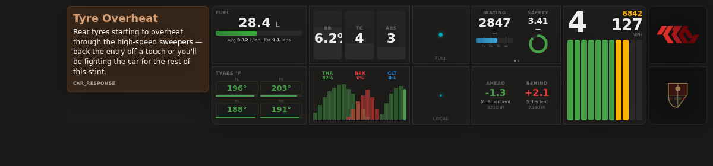

# K10 Motorsports — Dashboard Overlay

A standalone Electron overlay that renders real-time sim racing telemetry as a transparent HUD on top of your sim. Designed for stream overlays and broadcast production — it composites directly over the game window with no capture card or secondary monitor required. Also functions as a dedicated driving display in fullscreen Drive HUD mode.



## Overview

The dashboard connects to the K10 Motorsports SimHub plugin's HTTP API and renders telemetry data at ~30fps. It runs as a frameless, always-on-top, click-through window so the game receives all mouse and keyboard input normally. On systems that support native transparency (x64 Windows), the window background is fully transparent. On ARM devices (Surface Pro, Snapdragon laptops), it uses a green chroma key background for OBS Color Key compositing.

The `dashboard.html` file powers three deployment modes: the Electron overlay (this app), the SimHub built-in dashboard template, and direct browser access via the plugin's HTTP server.

## Quick Start

### Prerequisites

- Node.js 18+
- SimHub running with the K10 Motorsports plugin enabled
- The plugin's HTTP server active on port 8889 (starts automatically with the plugin)
- **iRacing users:** The [iRacing Extra Properties](https://drive.google.com/drive/folders/1AiIWHviD4j-_D-zgRrjJU1AFhJ_xmass) plugin by RomainRob (required for iRating and Safety Rating display)

### Install and Run

```bash
cd racecor-overlay
npm install
npm start
```

**Platform launchers** (double-click to run — auto-install dependencies):

- **macOS:** `scripts/mac/K10 Motorsports.command`
- **Windows:** `scripts/windows/start.bat`

The overlay appears in the top-right corner of your primary display. For ARM hardware, use safe mode: `npm run start:safe`

### Hotkeys

| Shortcut | Action |
|----------|--------|
| `Ctrl+Shift+S` | Toggle settings/move mode — drag to reposition, resize from edges |
| `Ctrl+Shift+F` | Toggle Drive HUD mode (fullscreen driving-focused display) |
| `Ctrl+Shift+H` | Hide or show the overlay |
| `Ctrl+Shift+G` | Toggle green-screen mode (restarts) |
| `Ctrl+Shift+R` | Reset overlay position and size to defaults |
| `Ctrl+Shift+D` | Restart demo sequence |
| `Ctrl+Shift+Q` | Quit the overlay |

## Dashboard Panels

### Main HUD

**Tachometer and Speed** — Large gear indicator (top-left), RPM readout (top-right), speed below. The tachometer bar segments fill from green through yellow to red as RPM approaches redline, flashing when RPM exceeds 95% of max.

**Live Lap Timer** — Current lap time displayed with a real-time delta-to-best overlay. The delta is color-coded: purple (PB pace), green (faster than best), amber (slightly slower), red (1s+ slower). Absolutely positioned so it never affects the lap counter layout regardless of digit count.

**Rating and Gaps (Cycling)** — Alternates between two pages every 45 seconds. Page 1 shows iRating with a horizontal fill bar (scaled 0–5000) and Safety Rating with a circular progress indicator (0–4.00). Page 2 shows current race position, gap to car ahead and behind with driver names and iRating values. Gaps flash green on overtakes and red when losing positions.

**Track Map** — SVG minimap rendered from the plugin's track path data. The player's car appears as a bright dot, centered at all times with heading-up rotation so the direction of travel always points upward. Opponents appear as smaller dim dots. Smooth 150ms CSS transition on rotation.

**Sector Timing** — Per-sector split times with brightness-coded performance indicators. Supports native iRacing sector boundaries (up to 7+ sectors) with automatic fallback to equidistant 3-sector splits. Resets cleanly on track changes.

**Pedal Traces** — Three side-by-side histogram columns showing throttle (green), brake (red), and clutch (blue) input traces. Each is a rolling 20-sample window. Current percentage displayed above each column.

**Controls (BB / TC / ABS)** — Brake bias percentage, traction control level, and ABS level with small vertical fill indicators. TC and ABS auto-hide if the car doesn't expose those channels.

**Fuel** — Current fuel level in liters with a color-transitioning bar (green → amber → red). Below: average consumption per lap, estimated laps remaining, and a "PIT in ~N laps" warning when fuel won't last the race distance.

**Tyres** — 2×2 grid of tyre temperatures in °F with heat-map background coloring (blue → green → red). Wear percentage drives cell opacity — worn tyres appear muted.

**Logo Column** — K10 logomark (top) and auto-detected manufacturer logo (bottom). Supports Porsche, BMW, Ferrari, McLaren, Mazda, Nissan, Dallara, and more. The game logo is placed in the diagonally opposite corner from the dashboard to avoid overlapping secondary panels.

### Secondary Panels

**Leaderboard** — Full-field position table with interval gaps and gap-to-leader columns. Updates in real-time as positions change.

**Datastream** — Live telemetry data stream showing raw and computed values for debugging and analysis.

**Incidents** — Incident count tracker with configurable penalty and DQ thresholds.

**Spotter** — Proximity overlay showing nearby cars with directional indicators.

**Pitbox** — Pit strategy management panel with tabbed navigation for fuel, tires, and pit options. Navigable via wheel buttons or Stream Deck through the plugin's registered actions.

### Race Overlays

**Race Control Banner** — Full-width overlay for race control messages (flags, cautions, session changes).

**Pit Limiter** — Speed overlay that activates when the pit limiter is engaged, showing current speed against the pit lane limit.

**Race End Screen** — Results display at the end of a race session.

### Commentary Panel

Slides in from the edge when the commentary engine fires an event. Shows topic title, commentary text, and category label. The panel border and background tint match the event's sentiment color — orange for warnings, red for critical, blue for informational, amber for strategy calls. Auto-dismisses when the event expires.

### Drive HUD Mode

Toggle with `Ctrl+Shift+F` for a fullscreen driving-focused display. Shows only track map with sectors, lap delta, position, spotter, and incident count — designed for direct racing without stream production elements.

## Visual Effects

### WebGL Post-Processing

A fullscreen WebGL2 fragment shader system (`webgl.js`) provides real-time visual effects driven by telemetry:

- **Center glow** and **bloom pulse** — dynamic brightness based on RPM and throttle
- **Light sweep** — periodic sweep effect across the dashboard
- **Panel glow** — individual panel illumination that responds to telemetry values
- **Dome specular** — simulated glass dome highlight
- **G-force vignette** — screen edge darkening proportional to lateral G-forces
- **RPM redline** — intensified glow effect at high RPM

The glare canvas renders at half device-pixel-ratio for performance. Per-frame timing and draw call counts are exposed via `window._glarePerf` for monitoring.

### Ambient Light Engine

The Electron main process captures a configurable screen region at ~4fps using `desktopCapturer`, extracts the dominant color, and sends it to the renderer via IPC. The ambient light module (`ambient-light.js`) uses LERP color interpolation to smooth transitions and updates CSS custom variables that drive glass refraction `::after` pseudo-elements on all panels. Two modes: matte and reflective.

## Architecture

```
┌──────────────────────────────────────────┐
│  SimHub + K10 Motorsports Plugin         │
│  ┌─────────────────────────────────────┐ │
│  │ HTTP Server (port 8889)             │ │
│  │ GET /racecor-io-pro-drive/           │ │
│  │ → flat JSON: 100+ properties        │ │
│  │   (telemetry, commentary, strategy) │ │
│  └─────────────────────────────────────┘ │
└───────────────────┬──────────────────────┘
                    │ HTTP GET (~30fps)
┌───────────────────▼──────────────────────┐
│  K10 Motorsports (Electron)              │
│  ┌─────────────────────────────────────┐ │
│  │ main.js         (main process)      │ │
│  │ • Window management + transparency  │ │
│  │ • Screen capture (ambient light)    │ │
│  │ • Settings persistence (IPC)        │ │
│  │ • Global hotkeys                    │ │
│  │ • Crash recovery                    │ │
│  │ • Remote LAN server                 │ │
│  ├─────────────────────────────────────┤ │
│  │ preload.js      (context bridge)    │ │
│  │ • k10.getSettings()                 │ │
│  │ • k10.saveSettings()               │ │
│  │ • k10.onSettingsMode()             │ │
│  │ • k10.onAmbientColor()            │ │
│  ├─────────────────────────────────────┤ │
│  │ dashboard.html   (renderer)         │ │
│  │ • 28+ JS modules (no build step)   │ │
│  │ • 10 CSS modules                    │ │
│  │ • WebGL2 shader pipeline            │ │
│  │ • Polling loop (fetchProps ~30fps)  │ │
│  │ • Settings overlay UI               │ │
│  └─────────────────────────────────────┘ │
└──────────────────────────────────────────┘
```

### Data Flow

1. The SimHub plugin serves all telemetry, commentary, and strategy state as a flat JSON object at `/racecor-io-pro-drive/` over HTTP on port 8889.

2. The dashboard's `fetchProps()` function issues a single HTTP GET every 33ms (~30fps). In demo mode, the dashboard reads from `K10Motorsports.Plugin.Demo.*` properties instead — the switching is transparent.

3. Each poll cycle, `pollUpdate()` routes JSON values to the appropriate module: updating DOM elements, CSS custom properties, SVG transforms, class toggles, and WebGL shader uniforms. Animations are driven by CSS transitions triggered by class changes.

4. The connection uses exponential backoff on failure (1s → 2s → 4s → 8s, capped at 10s) to avoid socket exhaustion when SimHub isn't running.

### Modules

| Module | Purpose |
|--------|---------|
| `poll-engine.js` | Telemetry polling, data routing, commentary/strategy display |
| `config.js` | Property subscriptions, state management, demo mode switching |
| `webgl.js` | WebGL2 fragment shader — glare, bloom, glow, vignette |
| `webgl-helpers.js` | Shader compilation, icon atlas generation |
| `ambient-light.js` | Screen color sampling, LERP interpolation, CSS variable updates |
| `ambient-capture.js` | Capture region UI configuration |
| `drive-hud.js` | Fullscreen driving-focused HUD mode |
| `leaderboard.js` | Full-field position/gap leaderboard |
| `datastream.js` | Live telemetry data stream |
| `spotter.js` | Proximity overlay |
| `pitbox.js` | Pit strategy management |
| `sector-hud.js` | Sector timing display |
| `track-map.js` | SVG minimap with heading-up rotation |
| `game-logo.js` | Manufacturer detection + logo rendering |
| `car-logos.js` | Manufacturer name → logo path resolution |
| `game-detect.js` | Active sim detection |
| `settings.js` | Settings panel UI + persistence |
| `connections.js` | Connection management + remote access |
| `keyboard.js` | Global hotkey handling |
| `commentary.js` | Commentary panel slide-in/out animation |

## Configuration

### In-App Settings

Press `Ctrl+Shift+S` to enter settings mode, then click the gear icon to open the settings panel. Toggle individual dashboard sections on or off: fuel, tyres, controls, pedal traces, track map, position/gaps, tachometer, commentary, K10 logo, car logo, leaderboard, datastream, incidents, and spotter.

You can also change the SimHub API URL for remote setups (e.g., `http://playbox.local:8889/racecor-io-pro-drive`).

Settings persist between sessions via Electron IPC to a JSON file, with localStorage fallback in browser mode.

### Layout Position

The settings panel includes a **Position** dropdown for screen corner or edge-center placement. For center positions, a **Flow Direction** selector appears. The **Swap Vertical** toggle reverses the top and bottom halves of all stacked panel columns.

### Window Position

In settings mode, drag the overlay anywhere on screen and resize from edges. Position and size persist between sessions. `Ctrl+Shift+R` resets to defaults.

## ARM Compatibility

On ARM64 Windows devices, the overlay automatically switches to chroma key mode (green background, solid panel backgrounds, software rendering). For OBS: add a Window Capture source → Filters → Color Key → green `#00FF00`.

On x64 systems, native transparency composites directly — no OBS filter needed.

## Deployment Modes

**Electron Overlay (Primary)** — Standalone app, always-on-top, click-through, hotkey controls. Best for streaming and broadcast.

**SimHub Dashboard Template** — The same `dashboard.html` installs as a SimHub dashboard template. Uses SimHub's `$prop()` API instead of HTTP polling.

**Browser Access** — Open `dashboard.html` in any browser while SimHub is running. Auto-detects non-SimHub environment and falls back to HTTP polling.

**LAN Remote** — The Electron app includes a built-in HTTP server for serving the dashboard to other devices on the local network.

## Troubleshooting

**Dashboard shows no data:** Open `http://localhost:8889/racecor-io-pro-drive/` in a browser. You should see a JSON blob with 100+ properties. If not, verify the K10 Motorsports plugin is enabled in SimHub.

**Overlay crashes on launch (ARM):** Use `npm run start:safe` for software rendering. Requires Electron 33+.

**Commentary panel never appears:** Enable Demo Mode in the plugin settings to trigger test events.

**Overlay covers clicks:** Press `Ctrl+Shift+S` to exit settings mode and restore click-through behavior.

**OBS shows black/solid overlay:** On x64, use Window Capture with "Allow Transparency" enabled. On ARM, use the Color Key filter.

**Drive HUD shows no map:** Track map data must be available from the plugin. Some tracks may not have SVG path data — export maps from the plugin's SimHub settings panel.
